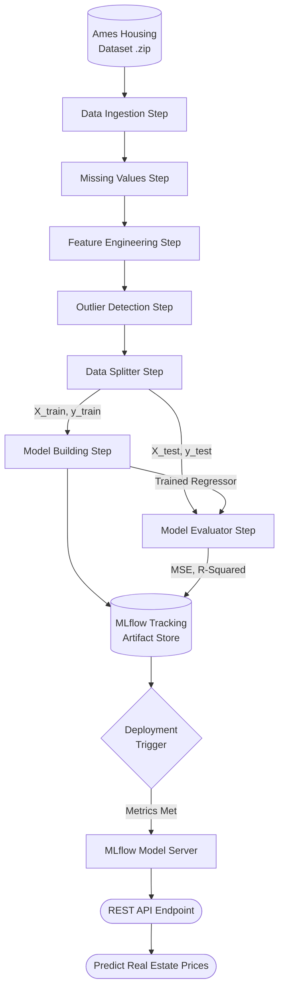

<div align="center">


<br/>

<!-- Primary Badges -->
<a href="https://github.com/dreamybear66/Prices-Prediction-System/stargazers"></a>
<a href="https://github.com/dreamybear66/Prices-Prediction-System/network/members"></a>


<br/><br/>

<!-- Tech Stack Badges -->
[](https://www.python.org/)
[](https://zenml.io/)
[](https://mlflow.org/)
[](https://scikit-learn.org/)
[](https://pandas.pydata.org/)
[](https://numpy.org/)

<br/><br/>

> ### 🌟 *An end-to-end, production-ready machine learning framework for predicting house prices. Built with ZenML for orchestration and MLflow for experiment tracking.*

<br/>

---

## 📋 Table of Contents

| Section | Link |
|---------|------|
| 💡 Project Overview | [Read](#-project-overview) |
| ✨ Features | [Read](#-features) |
| 🗂️ Repository Structure | [Read](#️-repository-structure) |
| 🔄 System Architecture | [Read](#-system-architecture) |
| 🛠️ Tech Stack | [Read](#️-tech-stack-deep-dive) |
| 🚀 Getting Started | [Read](#-getting-started) |
| 📊 MLOps Integration | [Read](#-mlops-integration) |
| 🤝 Contributing | [Read](#-contributing) |

---

</div>

## 💡 Project Overview

The **Prices Prediction System** is a modular machine learning pipeline designed to showcase production-grade MLOps practices. Using the Ames Housing dataset, it automates the entire lifecycle—from data ingestion and preprocessing to model training, evaluation, and deployment.

By leveraging **ZenML** to connect the various steps and **MLflow** to track metrics, this system guarantees reproducibility, scalable experimentation, and direct pathways to production deployment.

---

## ✨ Features

### 🧩 Modular ML Pipelines
- Abstracted pipeline steps for independent development and testing.
- Includes distinct modules for **Data Ingestion**, **Cleaning/Splitting**, and **Model Training**.

### 📈 Automated Experiment Tracking
- Integrated **MLflow** tracks parameters, metrics (MSE, R2), and artifacts automatically during training runs.

### 🚀 Seamless Deployment
- Features a localized continuous deployment pipeline utilizing `MLflowDeploymentLoaderStep`.
- Includes predictive serving infrastructure right out of the box via the `run_deployment.py` API.

### 📊 Exploratory Data Analysis (EDA)
- Dedicated analysis folder featuring **Bivariate Analysis**, **Multivariate Analysis**, and clear identification of missing values within the data distribution.

---

## 🗂️ Repository Structure

```
📦 Prices-Prediction-System
│
├── 📄 README.md
├── 📄 requirements.txt
├── 📄 config.yaml                      ← Pipeline configuration settings
│
├── 🚀 execution_scripts/
│   ├── run_pipeline.py                 ← Triggers the training ML pipeline
│   ├── run_deployment.py               ← Triggers CI/CD deployment pipeline
│   └── sample_predict.py               ← Test endpoint querying
│
├── 🧱 src/                             ← Core Machine Learning Logic
│   ├── ingest_data.py                  ← Data parsing factory
│   ├── data_splitter.py                ← Train/test split strategy
│   ├── feature_engineering.py          ← Feature parsing & transformations
│   ├── handle_missing_values.py        ← Imputation logic
│   ├── outlier_detection.py            ← Z-score and IQR clipping
│   ├── model_building.py               ← Scikit-Learn Model Regressors
│   └── model_evaluator.py              ← Model metrics generation
│
├── 🔗 steps/                           ← ZenML Pipeline Steps
│   ├── ingest_data_step.py
│   ├── handle_missing_values_step.py
│   ├── feature_engineering_step.py
│   ├── outlier_detection_step.py
│   ├── data_splitter_step.py
│   ├── model_building_step.py
│   ├── model_evaluator_step.py
│   └── prediction_service_loader_step.py
│
├── 🔨 pipelines/                       ← ZenML Pipeline Orchestrators
│   ├── training_pipeline.py            ← Training execution graph
│   └── deployment_pipeline.py          ← Deployment execution graph
│
└── 📊 analysis/                        ← Jupyter EDA & Analytics
    └── analyze_src/
        ├── bivariate_analysis.py
        ├── missing_values_analysis.py
        └── multivariate_analysis.py
```

---

## 🔄 System Architecture

### Pipeline Execution Flow



---

## 🛠️ Tech Stack Deep Dive

### Core Machine Learning
| Technology | Function |
|-----------|---------|
| **Python 3.11** | Core scripting language |
| **Scikit-Learn** | Predictive modeling (Linear Regression, Random Forest, etc.) |
| **Pandas** | Data manipulation and DataFrame routing |
| **NumPy** | High-performance numerical computation |
| **Matplotlib / Seaborn** | EDA visualization |

### MLOps & Orchestration
| Technology | Function |
|-----------|---------|
| **ZenML** | Pipeline orchestration and step abstraction |
| **MLflow** | Experiment tracking, Metric visualization, Model Registry |
| **Click** | CLI automation for execution scripts |

---

## 🚀 Getting Started

### ✅ Prerequisites

Ensure you have the following installed:
- **Python** `>= 3.8` (Recommended: 3.11)
- **Git**

---

### 📥 1. Clone & Set Up Environment

```bash
# Clone the repository
git clone https://github.com/dreamybear66/Prices-Prediction-System.git
cd Prices-Prediction-System

# Create a virtual environment
python -m venv venv

# Activate the virtual environment
# On Windows:
venv\Scripts\activate
# On macOS/Linux:
source venv/bin/activate

# Install dependencies
pip install -r requirements.txt
```

---

### 🔧 2. Initialize ZenML

ZenML requires an initial setup command to establish its local database.

```bash
zenml init
```

By default, ZenML runs on a local stack. To utilize MLflow tracking within the pipeline, you need to configure the MLflow integration:

```bash
# Install MLflow integration logic
zenml integration install mlflow -y

# Register MLflow Experiment Tracker
zenml experiment-tracker register mlflow_tracker --flavor=mlflow

# Register MLflow Model Deployer
zenml model-deployer register mlflow_deployer --flavor=mlflow

# Create a new ZenML stack with these components
zenml stack register mlflow_stack -a default -o default -d mlflow_deployer -e mlflow_tracker --set
```

---

### 🏃 3. Run the Training Pipeline

Execute the system to ingest data, train the model, and log all metrics:

```bash
python run_pipeline.py
```

---

### 🌐 4. View Tracking Metrics (MLflow)

Once the pipeline concludes, launch the MLflow User Interface to inspect your experiments:

```bash
# Command prints in the terminal after pipeline run
mlflow ui --backend-store-uri "file:<your-zenml-local-store-path>"
```
*Access the dashboard at `http://127.0.0.1:5000`.*

---

### 📦 5. Run Continuous Deployment

To simulate a deployment scenario where a model is only deployed if training metrics pass a certain threshold:

```bash
python run_deployment.py
```

Test the deployed endpoint with local sample data:
```bash
python sample_predict.py
```

---

## 🤝 Contributing

We welcome contributions! Here's how to get started:

1. **Fork** the repository
2. **Create** a feature branch: `git checkout -b feature/data-pipeline-upgrade`
3. **Commit** your changes: `git commit -m "feat: implement XGBoost Regressor"`
4. **Push** to your branch: `git push origin feature/data-pipeline-upgrade`
5. **Open** a Pull Request

---

## 📄 License

This project is open source and available under the **MIT License**.

---

<div align="center">

<br/>

**Built with ❤️ for scalable AI**

<br/>

⭐ **If this project helped you or inspired you, please give it a star!** ⭐

<br/>

[](https://github.com/dreamybear66)

</div>
